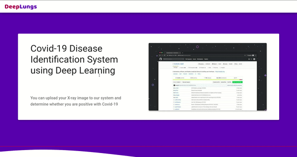

## DEEP LUNGS

### Run system

- Download checkpoint from this [link](https://drive.google.com/drive/folders/15t6uOUnvY17EmXTNXfTqox8iYwWgrxKU?usp=sharing)
- Place the model are downloaded into ./backend/saved
- Run script `python main.py` 